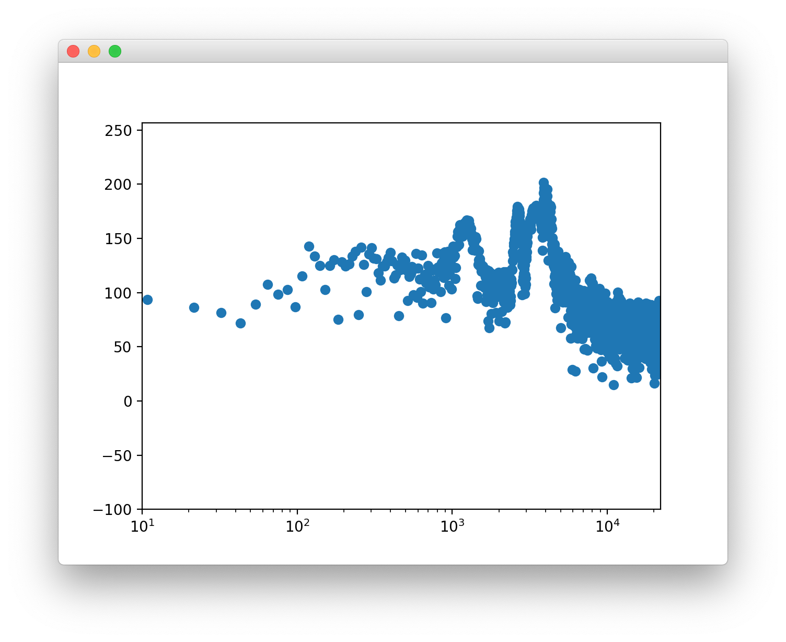

SPECTRE
=======




Requirements
------------
* portaudio  # **NOT PYTHON MODULE**
* pyaudio
* numpy
* matplotlib


recommend:
* scipy  # easy STFT; see [test3.py](./test3.py)

Usage
-----
```bash
spectre
```
or
```bash
python -m spectre
```


Install
-------
At first, install [portaudio](http://www.portaudio.com).
Then,
```bash
python -m pip install git+https://github.com/sakura067m/sample_pyaudio_stft.git
```
