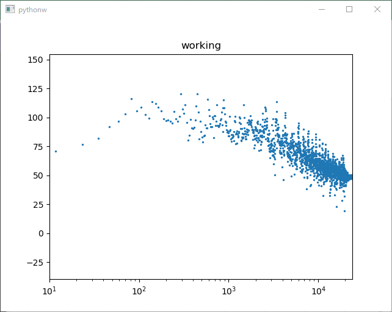

SPECTRE
=======





Requirements
------------
* portaudio  # **NOT PYTHON MODULE**
* pyaudio
* numpy
* matplotlib


recommend:
* scipy  # easy STFT; see [test2.py](./test2.py)

Usage
-----
```bash
spectre
```
or
```bash
python -m spectre
```

v1.1:
Add support for command line argument!
```bash
usage: spectre [-h] [-f FS] [-w NFFT] [-s MARKER_SIZE] [-v]

spectrum analyzer

optional arguments:
  -h, --help            show this help message and exit
  -f FS, --fs FS        sampling rate
  -w NFFT, --nfft NFFT  window size
  -s MARKER_SIZE, --marker_size MARKER_SIZE
                        marker size
  -v, --verbose         increase out put
```


Install
-------
At first, install [portaudio](http://www.portaudio.com).
Then,
```bash
python -m pip install git+https://github.com/sakura067m/sample_pyaudio_stft.git
```
